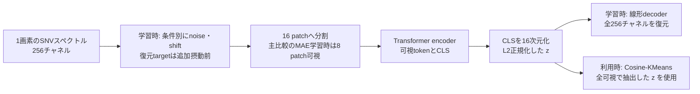

# ChemoMAEの特徴とケモメトリクスにおける位置づけ

本書は採用理由、ChemoMAE v0.2.2の構成、PCA・SNV幾何との関係、主張できる範囲を説明する。
研究の問いと説明文は[研究の目的](research_overview.md)、文献の比較と書誌は[関連研究](related_work.md)、
実験途中の所見は[解釈メモ](interpretation_notes.md)に分ける。固定条件の正は[実験プロトコル](design/experiment_protocol.md)とする。

- [採用理由とaugmentation](#1-この構成をどう捉えるか)
- [VRM的な解釈と近傍の定義](#augmentation-vicinity)
- [モデルと損失](#2-実装で確認できる構成)
- [PCA・L2正規化・SAM](#pca-comparison)
- [主張できる特徴と未検証事項](#5-本研究で主張できる特徴と評価を待つ事項)

## 1. この構成をどう捉えるか

本研究の主軸は、**状態を事前に定義しにくい材料の化学的な違いを捉える、自己教師ありスペクトル表現学習**である。
化学状態の区分や正解ラベルをあらかじめ定めにくい材料を問題設定とし、古材NIR-HSIを実証対象とする。
ChemoMAEは、帯域間の予測関係からスペクトルを低次元へ集約し、状態差を探索するための座標系を学ぶ役割を担う。
クラスタリングによってその座標を試料表面の領域へ対応づけ、マップの性質をCVで比較し、
NIRスペクトルと位置対応FT-IRから化学的な意味を検討する。研究全体の問いと証拠の対応は
[研究の目的と説明文](research_overview.md#research-focus)にまとめる。

**PCAと同じく、ラベルなしでスペクトルを圧縮し、得られた座標を可視化・クラスタリングに使う、
という目的に整合した構成である。** 再構成学習をこの用途に使う考え方には、
化学工学のautoassociative networkによる非線形PCAという前例がある。
近年のRaman解析にも、MAEの特徴をPCAなどと比較してクラスタリングする研究と、
非線形encoderを線形decoderと組み合わせる研究がある。
([Kramer, 1991](https://doi.org/10.1002/aic.690370209);
[Ren et al., 2025, §3.2](https://arxiv.org/html/2504.16130v1);
[Georgiev et al., 2024, Methods](https://arxiv.org/html/2403.04526v1))

そのため、説明の中心は「後で分類器をfine-tuneするための事前学習」よりも、
**「マスク再構成を基礎に、denoisingを組み合わせた学習課題によって、化学状態をよりよく捉える
低次元座標系の獲得を目指す」**と置くと意図が伝わりやすい。
本研究では、学習後のencoderを固定し、未知試料を含むスペクトルの座標を直接利用する。
denoisingの追加で表現が改善するという見通しは、採用時の仮説である。

ただし、PCAを数学的に包含する一般化だという意味で「PCAの拡張版」と呼ぶと、説明が過剰になる。
本構成のdecoderは線形1層で、潜在には単位norm制約がある。
**「PCAの役割を担う、線形再構成制約付きの非線形スペクトル表現学習」**
という位置づけが、目的と実装の両方に合っている。

### 1.1 MAEを選んだ理由: view間で何を不変にするかを定める難しさ

本研究ではaugmentationを検討・設計したうえで、**その設計だけでは、view間の対応づけを
学習の中心に置くSSLへ移る根拠が十分でない**と判断した。問題は変換の実装だけではなく、
保持すべき情報と変えてよい情報、viewの多様性、操作の組合せ・強度・確率をどう定めるかにある。
SimCLRの原論文も、augmentationの組合せが学習課題と表現の品質に関わることを示している。
([Chen et al., 2020](https://proceedings.mlr.press/v119/chen20j.html))

古材のスペクトルには、劣化、樹種、表面性状などに関わる変動が重なりうる。
そのうち何を状態差として残し、何に対して不変な表現を求めるかは自明でない。
今回のnoise・shiftは、同じ化学状態を表す十分に多様なviewの族として妥当性を確立したものではない。
ここで「不変性学習のための設計として弱い」とは、単に摂動幅が小さいという意味ではなく、
**何を共通情報として対応づけるべきか、その根拠と変換の多様性が十分に定まっていない**という意味である。

また、古材という対象に合わせて広範なablationからレシピを選んでも、その結果を別の材料・試料構成・
測定条件へ適用できる根拠は別途必要になる。本研究では、対象固有のレシピ探索を研究の中心に置かず、
帯域間の予測関係を使うMAEを基礎とし、追加摂動はdenoisingの学習課題に組み込む方針を採った。
この範囲の判断により、SimCLR・BYOL・DINOなどのview間対応を用いるSSLは今回試さない。
これは、古材でのレシピ探索が無価値である、あるいはこれらの手法が分光に不適切であるという
一般的な結論ではない。未比較の手法に対するMAEの優位性も主張しない。

| 学習方法 | 学習課題におけるviewの役割 | 本研究で問題にしている設計判断 |
| --- | --- | --- |
| [SimCLR](https://proceedings.mlr.press/v119/chen20j.html) | 同一入力から作ったviewを正例として対応づけ、他の例との対比を行う | 何を変えても同じ例として近づけてよいか。原論文もaugmentationの組合せを重要な要素とする |
| [BYOL](https://arxiv.org/html/2006.07733v3) | 一方のviewから、別viewのtarget network表現を予測する | 負例を必要としなくても、対応づけるviewをどう作るかは残る |
| [DINO](https://arxiv.org/html/2104.14294v2) | 異なるview間でteacherとstudentの出力分布を対応づける | 化学的に意味のある情報を保つview・cropの設計が必要になる |
| 本研究のM00 | 可視帯域から隠れた帯域の元の値を予測する | 隠す単位・割合と再構成targetを定める。追加noise・shiftなしで課題が成立する |
| 本研究のM10・M01・M11 | noise・shiftを加えた可視帯域から、追加摂動前の隠れた帯域を予測する | どの摂動から元のスペクトルを復元させるかというcorruptionの仮定を置く |

BYOL・DINOをSimCLRと同じ負例付き対比学習として扱わない。上表で共通しているのは、
異なるviewの間で何を対応づけるかという設計の必要性であり、損失やaugmentation感度の同一性ではない。
また、これらの対応づけはprojection head等の出力に課されるため、encoderの全情報が厳密に
不変になるという意味でもない。

MAEの採用によって抑えたいのは、**化学状態を保つ多様なviewの族を定め、その間の対応づけを
学習の中心に置くことへの依存**である。maskも入力を変える操作であり、patch分割、mask率、
SNV、MSE、16次元圧縮、線形decoderといった帰納的な制約はある。
また、予測しやすい帯域間の相関が、目的とする化学状態だけに由来する保証もない。

### 1.2 noise・shiftを加えた理由: denoisingを表現学習の課題にする

noise・shiftの導入目的は、**MAEの帯域補完に、追加摂動前のスペクトルを復元するdenoisingを
組み合わせ、化学状態をより安定して反映する潜在表現の学習につなげること**である。
期待しているのは、摂動された観測から元のスペクトルを説明するために、帯域間の依存関係や
データに共通する構造を捉える学習が促されることである。ノイズ除去性能や、指定したnoise・shiftに
対する耐性そのものを獲得することを、導入の主目的とはしていない。

この発想は、corruptionからの復元を有用な表現を学ぶための課題とするDenoising AEに対応する。
Vincentらは、denoisingを中間表現の学習基準として導入し、分類実験などでその有用性を検討した。
本研究が参照するのはこの学習原理であり、古材NIRで化学状態が抽出できるという実証ではない。
([Vincent et al., 2008, §2–4](https://www.cs.toronto.edu/~larocheh/publications/icml-2008-denoising-autoencoders.pdf);
[Vincent et al., 2010, §3](https://jmlr.org/papers/volume11/vincent10a/vincent10a.pdf))

view間対応では、変換後のview同士に共通して残す情報を定める必要がある。一方、今回のdenoisingでは
**追加摂動前の観測スペクトルを復元の基準として明示できる**。現在のaugmentation設計を使う範囲では、
この復元課題のほうが研究上の意図を限定して説明しやすい、と判断した。
ただし、denoisingも「このcorruptionを与えても、元の観測を復元すべきだ」という仮定を置く。
同じtargetへの復元は潜在に間接的な制約を与えるため、不変性と無関係でもなく、常にview間対応より
弱い仮定で済むという一般的な序列でもない。

MAEのmaskも広い意味ではcorruptionである。本書で「denoisingを追加する」とは、maskによる欠落に
noise・shiftによる入力の変化を組み合わせることを指す。追加摂動前の値をtargetに保ち、
**ランダムマスクで選ばれた帯域への復元損失を通じて、今回のAugに対する全帯域にわたるdenoisingを
学習する**。1回の更新で損失を計算するのは隠した帯域だが、その対象は学習を通じて入れ替わる
（第2.2節）。ここでのcleanは**追加摂動前**という意味であり、測定ノイズのない真値を意味しない。

目指すのは、潜在の各軸を純粋成分や存在比として同定することではなく、
**スペクトル全体の関係を集約した表現の中で、化学状態に関連する違いがまとまりとして現れるか**
を調べることである。この目的から、再構成に必要な情報を単一のCLS由来bottleneckへ集約する。
CLSは教師あり分類ラベルを表すものではなく、1画素のスペクトル全体を表すための集約tokenである。
ただし、CLSを使うこと自体が化学状態の分離を保証するわけではない。

研究上の問いは、**「マスク再構成と、それにdenoisingを組み合わせた学習が、全可視で取り出す
潜在の幾何をどう変え、化学状態に関連すると考えられるスペクトル群を、より状態差の捉えやすい
表現にするか」**である。ここでの「構造推論」はスペクトル内の帯域間関係を推定する意味で使い、分子構造や
化学組成を直接同定する意味では使わない。化学状態が連続的に変化し、明確な離散クラスタを
持たない可能性も含めて検討する。

これは再構成の目的からクラスタ構造が生じるかを問う仮説であり、コンパクトで分離したクラスタを
損失が直接要求しているわけではない。現在の外部ラベルを使わない評価では、化学状態との対応は
探索的解釈に留まる。詳細は第5節に示す。

M00を追加augmentationなしの基礎条件とし、M11対B0・B1・M00という既定の主要比較と、
noise・shiftの有無による2×2 ablationで追加corruptionの効果を調べる。
このablationは固定したレシピ内の比較であり、view設計の最適化や、他のSSLとの比較を目的としない。

### 1.3 augmentationの仮定: 幾何的制約と実際のスペクトル変動を分ける

今回のaugmentationは、**SNV後のスペクトルの幾何的制約に基づくcorruption設計**である。
物理化学的な生成過程や装置の誤差分布をモデル化して導いたものではない。
固定仕様では各操作後に画素内平均を0、normを操作前の値へ戻し、noise強度を角度で制御する。
noiseはGaussian乱数から平均ゼロ・入力に直交する方向を作り、その方向へ
$\theta\sim U(0,5^\circ)$ だけ回転する。shiftは256点の等間隔波長grid上で
$\delta\sim U(-2,2)$ チャネルのfractional shiftを行い、線形補間と端点値の延長を使う。
([augmentationの固定仕様](design/experiment_protocol.md))

この設計が保つのは各スペクトルの平均・normなどの制約である。独立に摂動した画素間の角度、
吸収帯の帰属、化学状態を保存する保証はない。SNVの制約を満たす点の集合と、実在する化学状態に
対応するスペクトルの集合も同一ではない。幾何的に整合することを、物理化学的な妥当性の証明には使わない。

noiseや波長方向のずれが実測で生じうることは、操作を検討する背景にはなる。ただし、
実測での原因と、今回の人工的な操作が表すものを次のように区別する。

| 変動 | 文献で確認できる原因・現象 | 今回の設計との関係と限界 |
| --- | --- | --- |
| 測定noise | 光子数の統計的揺らぎ、暗電流由来のshot noise、読み出しnoiseなどがある。SNRが低い条件では信号に対するnoiseの寄与が大きい | 「低SNRだからnoiseが発生する」という因果ではない。今回の角度摂動は帯域別SNRや信号依存性から生成しておらず、低SNR帯域の実測noiseを再現したものではない。([Hamamatsu Photonics, §1.2–1.3](https://hub.hamamatsu.com/us/en/technical-notes/image-sensors/image-sensors-product-selection.html)) |
| 装置に由来する波長位置のずれ | pushbroom型HSIでは光学的な歪みにより、同じbandの中心波長が検出器の列位置に依存するspectral smileが生じうる。HISUIではVNIR・SWIRで実測されている | 波長校正上のずれが存在する例である。今回の画素ごとの一様な軸方向shiftは、実機の列・波長依存性や応答幅の変化を再現しない。([Yamamoto et al., 2022, §I](https://doi.org/10.1109/TGRS.2022.3190486)) |
| 試料状態に伴うピーク位置の変化 | 水・glucose水溶液のNIRでは、昇温に伴う見かけのピーク移動が報告され、水素結合状態に関わる重なった帯域の相対強度変化として解釈されている | 状態に関する情報を含む変化であり、除去してよい測定誤差とは限らない。また、スペクトル全体の一様な平行移動とも異なる。([Cui et al., 2016, §3.1](https://pubs.rsc.org/en/content/articlehtml/2016/ra/c6ra18912a)) |

したがって、**「noiseやshiftは実際に起こりうる」ことから、「今回の変換は化学状態を保つ」ことや
「その変換に不変な表現を学ぶべきだ」までは導けない**。上記文献は現象の例を示すもので、
本研究の古材データにおけるずれの発生・原因・大きさを同定したものではない。
摂動幅も実機の測定誤差から推定した値ではなく、事前固定した学習条件である。

本研究では、この限定したcorruptionから元の観測を復元する学習が表現に有用かを問う。
化学的に重要な微小差の抑制や、元の観測に含まれる測定上の特徴の学習もありうるため、
denoisingを採用したこと自体で「化学状態に頑健な潜在空間」を獲得したとはしない。

### 1.4 提案するaugmentation: Tangent Gaussian NoiseとFractional Shift

本研究では、[著者の解説記事 §3.2–3.3](https://zenn.dev/mantis_ryuji/articles/e17b4d223cd7da)に示した
Tangent Gaussian Noise（TGN）とFractional Shiftを採用し、augmentation自体も提案として
位置づける。具体的な提案内容は、**SNVの平均ゼロ・一定norm制約を保つ摂動の定義と、
それをmasked denoisingへ組み込むこと**である。既存部品の採用理由だけでなく、操作の設計も説明する。
文献上の優先性は第5.1節で分けて扱う。

以下は[固定仕様](design/experiment_protocol.md)とChemoMAE v0.2.2の`SpectraAugmenter`を照合した
理想演算での記述である。帯域数を $C=256$、$r=\sqrt{C-1}=\sqrt{255}$ とし、
平均ゼロ・norm $r$ の入力 $x$、単位方向 $u=x/r$、全要素1のベクトル $\mathbf{1}$ を用いる。
TGNはGaussian方向から平均方向と半径方向を除き、残った接方向へ回転する。

$$
P=I-\frac{\mathbf{1}\mathbf{1}^{\mathsf T}}{C},\qquad
\epsilon\sim\mathcal{N}(0,I),\qquad
v=P\epsilon-u\bigl(u^{\mathsf T}P\epsilon\bigr),\qquad
q=\frac{v}{\lVert v\rVert_2}.
$$

$$
T_{\mathrm{TGN}}(x)=r\bigl(\cos\theta\,u+\sin\theta\,q\bigr),\qquad
\theta\sim U(0,\pi/36).
$$

$\lVert v\rVert_2>0$ の通常の場合、$q$ は平均ゼロ、$x$ と直交、単位normであり、出力も
平均ゼロ・norm $r$ を保つ。上の角度範囲は本研究で固定した $0$–$5^\circ$ をradianで表したものとなる。
入力と出力の角度は $\theta$、半径 $r$ の球面上の弧長は $r\theta$ であり、両者を区別する。
Gaussianは方向候補の生成分布を指し、角度や最終残差の分布ではない。

Fractional Shiftでは、チャネルindex上の線形補間と端点値の延長を行う操作を $S_\delta$ とすると、
補間後の再中心化・再正規化は次のように書ける。

$$
y=P S_\delta(x),\qquad
T_{\mathrm{FS}}(x)=r\frac{y}{\lVert y\rVert_2},\qquad
\delta\sim U(-2,2).
$$

$\lVert y\rVert_2>0$ ならSNV制約集合へ戻る。shift幅が同じでも入力形状によって角度変化は異なるため、
TGNと同じ角度制御とはしない。両式のゼロ・極小normには実装で`eps=1e-8`による保護があり、
退化した接方向または再投影候補では元の入力を保持する。制約の等式は浮動小数演算での厳密一致を意味しない。

記事では母標準偏差に対応する半径 $\sqrt{C}$ とcosine類似度 $\rho$ の一様抽選を用いるが、
本研究は標本標準偏差に対応する $\sqrt{C-1}$ と**角度 $\theta$ の一様抽選**を採用する。
$\rho=\cos\theta$ と変数を書き換えても一様分布同士は一致しない。shiftの軸も本研究では等間隔の
波長gridであり、記事の波数軸という説明をそのまま移さない。操作の発想を参照し、設定は本研究の固定仕様に従う。
M11では各操作を画素ごとに確率0.5で適用し、順序をbatchごとにランダム化するため、
常に同じ順序で両操作を適用する合成式を実装仕様として書かない。

角度で強度を明示できることはTGNの設計上の特徴である。ただし、化学的に許容される角度が自動で
決まるわけではない。現行の2×2 ablationはTGN・shiftを追加する効果を調べるもので、通常の加法noiseや
再投影なしshiftとの比較は含まないため、**幾何制約を保つこと自体の優位性を単独で実証する比較ではない**。

### 1.5 VRM的な解釈: 表現の幾何に沿って学習信号を広げる

2026-09-11の議論から、現在のaugmentationを**「観測点の周囲へ学習信号を広げるために、
SNV後の表現に即した近傍と復元課題を定義する」**と整理する。これは現行構成の説明を補う解釈であり、
採用時にVRMから導出したという記録や、新しい学習条件の決定ではない。

Vicinal Risk Minimization（VRM）的に捉えると、各観測点 $x_i$ に条件付き生成分布
$\nu(\tilde{x}\mid x_i)$ を置き、その周囲にも復元の学習信号を与える。
本構成では $\nu$ をmask前の全帯域スペクトルに対するnoise・shiftの分布とし、
操作を適用しない確率も含める。第2.2節のmasked denoisingは、概念的には次の期待損失で表せる。

$$
\widehat{R}_{\nu}(\psi)
=\frac{1}{n}\sum_{i=1}^{n}
\mathbb{E}_{\tilde{x}\sim\nu(\cdot\mid x_i)}
\mathbb{E}_{M}
\left[\ell_M\bigl(h_\psi(\tilde{x};V(M)),x_i\bigr)\right].
$$

$n$ は学習に使う観測スペクトル数、$M$ は隠すチャネル集合、$V(M)$ は対応する可視patch集合、
$h_\psi$ は単位潜在を経由するencoder・decoder全体、$\ell_M$ は隠したチャネルの平均二乗誤差である。
追加摂動前の観測 $x_i$ をtargetに固定するため、近傍の定義は入力の生成だけでなく、
**どの入力から何を復元させるか**という学習上の仮定を含む。
ここでのVRMは学習信号の広げ方を説明する枠組みであり、教師ありVRMの理論的保証を
本構成へ移したという意味ではない。損失・mask・抽出時の挙動は第2.2節を正とする。

この観点では、次の三つを別々に問う。

| 観点 | 確認する内容 | 本構成での扱い |
| --- | --- | --- |
| 表現の幾何との整合性 | 生成する全帯域スペクトルが既知の平均・norm制約を満たすか | TGNと再投影付きshiftが理想演算で保存する性質 |
| 学習課題との整合性 | 指定した摂動とmaskから元の観測を復元させることが、有用な構造の学習につながるか | denoisingの仮定であり、幾何の保存だけでは保証されない |
| 物理化学的な実現可能性 | 生成点が実在の化学状態や測定過程に対応するか | 今回のcorruptionに課した要件ではなく、実証もしていない |

したがって、生成した各点の物理的な実在性を保証しなくても、学習用の近傍として設計する意義はある。
一方、化学的に重要な差を失わずに有用な表現が得られるかという問いは残る。
小さい角度も、その保証や化学的な許容範囲の同定にはならない。

SNV制約集合 $\mathcal{M}_{\mathrm{SNV}}$（第3.3節）上では、半径 $r=\sqrt{C-1}$ として
入力 $x$ と生成点 $\tilde{x}$ の距離を次のように対応づけられる。

$$
d_{\mathcal{M}}(x,\tilde{x})
=r\arccos\left(\frac{x^{\mathsf T}\tilde{x}}{r^2}\right),\qquad
\lVert x-\tilde{x}\rVert_2
=2r\sin\left(\frac{d_{\mathcal{M}}(x,\tilde{x})}{2r}\right).
$$

TGN単独では $d_{\mathcal{M}}=r\theta$ となり、近傍の広さを角度で明示できる。
ただし、距離だけでは方向の分布やtargetは決まらず、それらも近傍設計の一部である。
球面上では弦長と測地距離は単調に対応するため、Euclidean距離そのものを不適切とはしない。
区別すべきなのは、球面上の点同士の距離と、周囲の空間で加法noiseを生成する操作である。
再投影を伴わない非退化なGaussian加算はSNV制約集合を確率1で外れるが、
そのことだけでdenoising用corruptionとして無意味だとは結論できない。
本研究は、既知の表現制約を保つ近傍を設計上の選択として採用する。
加法noise後に再SNVを行う方式なら制約集合へ戻せるため、TGNとの違いは生成方向・角度分布まで含めて扱う。

ここで保存するのは、**mask前の全帯域スペクトルが属するSNV制約集合**である。
その集合全体を実データのsupportや化学状態の多様体とはみなさず、mask後の可視部分や
decoder出力にも同じ制約が自動で成り立つとはしない。
本設計の主張は、SNVに沿った制御可能な近傍をmasked denoisingへ使うことにあり、
有用性と化学的な対応は第5節の評価・解釈の範囲で別途検討する。

## 2. 実装で確認できる構成

### 2.1 スペクトル全体を単一の潜在ベクトルへ圧縮する

| 部分 | 本研究で採用する構成 | 意味 |
| --- | --- | --- |
| 入力 | 画素ごとの256チャネルSNVスペクトル | 1つの入力は1画素のスペクトル。近傍画素や座標はencoderへ渡さない |
| patch | 連続16チャネルを1 patchとする16分割 | patch内は線形射影、patch間の関係はattentionで扱う |
| mask | M00など主比較のMAE条件は16 patch中8個を隠す | 可視8 tokenにCLSを加え、9 tokenをencoderへ入力 |
| encoder | 幅256、8層、8 head、FFN幅1024、GELU、pre-norm、dropout 0 | 学習可能な位置埋め込みを加え、可視patchの情報を非線形に統合 |
| bottleneck | 最終CLSを線形射影して16次元化し、L2正規化 | 学習中も抽出時も、スペクトル全体を単一の単位ベクトルで表す |
| decoder | bias付き `Linear(16, 256)` | 単一の潜在ベクトルから全256チャネルを復元 |
| 損失 | 追加摂動前のSNVに対するMSE | MAE条件は各stepで隠したチャネルを対象とし、ランダムマスクを通じて全帯域を学習。A0は毎回全チャネルで平均 |
| 利用時 | 全patch可視、augmentationなし、encoder固定 | 17 tokenから16次元表現を抽出し、Cosine-KMeansへ渡す |

根拠は[固定設定](../src/wood_degradation_map/experiments/config.py)、
[mask生成・表現抽出](../src/wood_degradation_map/experiments/neural.py)、
[学習処理](../src/wood_degradation_map/experiments/training.py)、および
[参照モデルの実装](https://github.com/Mantis-Ryuji/ChemoMAE/blob/4ec7f6acecb82035c85001f5aee508910d40adac/src/chemomae/models/chemo_mae.py)。
今回の説明はプロジェクトが明示する `decoder_num_layers=1` に対するものであり、
ChemoMAEライブラリの別設定まで一律に線形decoderだとするものではない。

decoderへ渡るのは $z$ だけであり、patchごとのencoder出力、入力からのskip connection、
decoder用mask tokenは渡らない。したがって、再構成に使う入力由来の情報は16次元の
bottleneckを通る。これは「小さいdecoder」というだけでなく、**情報を集約する場所を明確にした構成**である。

### 2.2 学習している写像と損失

追加摂動前の観測SNV（clean target）を $x_i\in\mathbb{R}^{256}$、入力側のaugmentationを $g$、
可視patchの集合を $V_i$ とする。$f_\theta$ はCLSの16次元射影までを含むencoderとする。
通常の非ゼロnorm領域では、モデルは次のように書ける。

$$
u_i=f_\theta(g(x_i);V_i),\qquad
z_i=\frac{u_i}{\lVert u_i\rVert_2},\qquad
\hat{x}_i=Wz_i+b,
\quad W\in\mathbb{R}^{256\times16},\quad b\in\mathbb{R}^{256}.
$$

実装のL2正規化は分母にepsilonによる保護を持つ。表現抽出では、正規化前の非有限値、
ゼロnorm、極小normを検査する。上式はその保護が作動しない通常の場合を表す。

主比較のMAE条件では、隠した8 patchに属するチャネル集合を $M_i$ とすれば、
$|M_i|=8\times16=128$ なので、batch sizeを $B$ とした共通の再構成損失は

$$
\mathcal{L}_{\mathrm{MAE}}
=\frac{1}{B}\sum_{i=1}^{B}
\frac{1}{128}\sum_{j\in M_i}
\left([Wz_i+b]_j-x_{ij}\right)^2.
$$

M00では $g$ は恒等写像であり、maskを繰り返し抽選することで、可視帯域から隠れた帯域を予測する。
M10・M01・M11では、それぞれnoise・shift・両方を入力側へ適用し、targetは追加摂動前のSNVのままとする。
shiftを適用してもtargetの波長位置は動かさない。
適用確率と強度は[実験プロトコル §4.1.3](design/experiment_protocol.md)に従う。
ここでいうnoiseは指定角度の回転による摂動であり、独立な加算Gaussian雑音と同一ではない。

したがって、M10・M01・M11は**摂動された可視帯域から、元のスペクトルの隠れた帯域を復元する課題**
になる。出力は全256チャネルだが、可視帯域の復元誤差はそのstepのlossに入らない。
ただし、maskは固定した波長域を常に隠すものではなく、各画素・各学習stepでランダムに抽選する。
各帯域が復元対象となる機会を持つため、**学習全体では全帯域を対象とするdenoisingを学習する**
と説明できる。masked lossという実装上の記述は、denoisingの学習対象が特定の帯域に限られることを
意味しない。

区別するのは、**各stepでの損失計算範囲**と、**ランダムマスクを通じた学習全体の対象範囲**である。
maskについて平均した目的関数は、各帯域について「その帯域を隠した入力から復元する」誤差を含む。
予測値自体もmaskに依存するため、毎回全帯域の損失を計算する目的関数や、全可視入力からのdenoisingと
同一の目的関数になるわけではない。本書の表現は学習課題を指し、復元精度の達成を報告するものではない。
A0は追加摂動なし・全可視とし、内側の和を全256チャネル、分母を256に変える。

損失にはクラスラベル、KMeansの割当て、空間的一貫性、対比学習の項は含まれない。
上式は再構成の目的関数であり、optimizerのAdamWによるweight decayとは区別する。
実際の学習経路は `Trainer._compute_loss` で、`loss_type="mse"`、`reduction="mean"` と
条件別の `loss_region` を使用する。
([学習処理](../src/wood_degradation_map/experiments/training.py);
[参照Trainer](https://github.com/Mantis-Ryuji/ChemoMAE/blob/4ec7f6acecb82035c85001f5aee508910d40adac/src/chemomae/training/trainer.py);
[参照loss](https://github.com/Mantis-Ryuji/ChemoMAE/blob/4ec7f6acecb82035c85001f5aee508910d40adac/src/chemomae/models/losses.py))

## 3. PCAとの共通点と、数学的に異なる点

### 3.1 「スペクトルの座標と復元方向を学ぶ」という見方

通常の16成分PCAでは、train平均を $\mu$、直交する主成分方向を列に持つ行列を $P$ として、
score $t_i$ と再構成を次のように表す。

$$
t_i=P^{\mathsf T}(x_i-\mu),\qquad
\hat{x}^{\mathrm{PCA}}_i=\mu+Pt_i,\qquad
P^{\mathsf T}P=I_{16}.
$$

ChemoMAEでは、scoreに相当する $z_i$ を非線形encoderが求め、$W$ が共通の復元方向を担う。
行に各スペクトルを並べれば、再構成は

$$
\hat{X}=ZW^{\mathsf T}+\mathbf{1}b^{\mathsf T}
$$

と書ける。**「非線形に推定した座標を用いる、制約付きの低ランク再構成」**という解釈ができる。
これは本構成からの数理的な解釈であり、独立した新手法名や性能上の結論を意味しない。

| 観点 | PCA baseline B1 | 本研究のChemoMAE |
| --- | --- | --- |
| 目的・使い方 | ラベルなしの圧縮後、scoreをクラスタリングへ利用 | ラベルなしの再構成学習後、潜在をクラスタリングへ利用 |
| 入力から座標への写像 | train平均で中心化した線形射影 | 可視patchの関係に依存する非線形写像 |
| 再構成 | PCA部分空間への直交射影 | 単位norm潜在からのアフィン写像 |
| 学習目標 | 全帯域の二乗再構成誤差に対応する分散最大化 | A0は全帯域MSE、MAE条件はmasked MSE |
| 軸の性質 | 固有値による順序と直交性を持つ | 軸の直交性・分散順序を課していない |
| L2正規化 | PCAのfit後、クラスタリング用scoreに適用 | 再構成学習のbottleneck内部から適用 |
| 化学的意味 | loadingの解釈には別途検討が必要 | 潜在成分やdecoder列に化学成分の意味は保証されない |

クラスタリングへ渡す段階ではB1もChemoMAEも16次元の単位ベクトルである。
違いは、PCAでは正規化前のscoreを使って学習・再構成を定義できるのに対し、
本ChemoMAEでは再構成する時点ですでに潜在のnormを取り除いていることにある。

線形autoencoderとPCAの関係は古典的に研究されているが、その同値性は線形写像や二乗誤差などの
条件に依存する。本構成の非線形encoder、mask、単位norm制約へそのまま拡張できない。
([Baldi & Hornik, 1989](https://doi.org/10.1016/0893-6080(89)90014-2))

### 3.2 非線形なのは座標推定であり、復元可能な範囲には強い制約がある

以下は実装の $\hat{x}=Wz+b$ から直接導ける性質である。

$$
\hat{x}\in b+\operatorname{col}(W),\qquad
\operatorname{rank}(W)\le16.
$$

したがって、復元スペクトルは高々16次元のアフィン部分空間に含まれる。
encoderを深くしても、この復元範囲が一般の非線形曲面へ広がるわけではない。
さらに $\lVert z\rVert_2=1$ のため、16次元ベクトルの自由度は通常15である。
$W$ が列full rankなら、単位球面の像はこの部分空間内の楕円体表面になる。
ただし、そのアフィン包の次元まで15になるという意味ではない。

これは、非線形decoderで潜在座標から曲がった復元多様体を作る型の非線形PCAとの違いである。
Kramerのモデルはbottleneckの前後に非線形変換を置くため、現在の線形decoder構成と
同じモデルではない。([Kramer, 1991](https://doi.org/10.1002/aic.690370209))

**全帯域のtrain再構成誤差だけなら、理想的な16成分PCAには優位性がある。**
同じ有限のtrainデータ、同じ前処理、同じ画素重み、二乗誤差を使う場合、
PCAは次元16以下のアフィン部分空間による最小二乗近似を与える。
ChemoMAEの復元もそのような部分空間に含まれるので、厳密演算での最適PCAを基準にすれば

$$
\sum_i\lVert x_i-\hat{x}^{\mathrm{PCA}}_i\rVert_2^2
\le
\sum_i\lVert x_i-(Wz_i+b)\rVert_2^2.
$$

これはPCAの最適性と本decoderの形からの推論であり、実験結果ではない。
比較対象はL2正規化前のPCA scoreで復元したものとし、数値計算・近似solverの差は除く。
masked MSE、未知試料の誤差、クラスタリング品質についての大小関係は、この式からは分からない。

したがって、本構成の価値を検証する焦点は、全trainスペクトルの圧縮誤差でPCAを超えることよりも、
**可視帯域から座標を推定する学習が、未知試料での表現・マップの性質をどう変えるか**にある。
さらに、denoisingを組み合わせることで、化学状態を捉えるうえで有用な表現の学習につながるかを問う。

### 3.3 L2正規化の主理由: SNVの一定normを踏まえた自由度の制限

本研究で潜在をL2正規化する主理由は、**SNV後のスペクトルはすでにnormが揃っているため、
その情報を集約する潜在にも、積極的な理由のないnormの自由度を持たせない**という設計判断である。
情報を方向に集約するという、自由度を減らす側からの選択であり、後段のcosineクラスタリングとの
整合性は、そのうえで得られる利点として位置づける。

本入力は256帯域について画素内平均0・標本標準偏差1へSNV変換するため、理想演算では

$$
\sum_{j=1}^{256}x_{ij}=0,\qquad \lVert x_i\rVert_2=\sqrt{255}
$$

となる。全帯域のSNVスペクトルは方向が分かれば確定し、normには画素間の違いを表す情報がない。
入力を単位化した $x_i/\sqrt{255}$ からも、共通の定数倍で元のSNVスペクトルへ戻せる。
この性質を踏まえ、圧縮後も情報を方向として表現させる方針を採った。
([前処理仕様 §5.6](design/preprocessing.md))

一般に、標本標準偏差でSNV変換した非定数スペクトルの制約集合は

$$
\mathcal{M}_{\mathrm{SNV}}
=\{x\in\mathbb{R}^{C}:\mathbf{1}^{\mathsf T}x=0,\ \lVert x\rVert_2=\sqrt{C-1}\}
$$

である。平均ゼロ超平面の次元は $C-1$、その中の球面の内在次元は $C-2$ なので、
本入力では半径 $\sqrt{255}$ の254次元球面となる。周囲の $\mathbb{R}^{256}$ の球面全体とは区別する。
16次元単位潜在には平均ゼロ制約を課していないため、この入力の次元の議論をそのまま潜在へ適用しない。
SNVがscore plotに曲線状の構造を誘導しうることには既報があり、SNVの幾何そのものを新規提案とはしない。
([Fearn et al., 2009](https://doi.org/10.1016/j.chemolab.2008.11.006))

ただし、入力の一定normは、非線形encoderの潜在にも自動的に引き継がれる性質ではない。
別の符号化では潜在のnormにスペクトル形状の情報を載せることも可能である。
したがって「潜在のnormは数学的に必ず不要」とするのではなく、**本研究ではその自由度を
採用しないという意図的な帰納的制約**として説明する。入力の単位化が可逆であることから、
16次元への圧縮や潜在の正規化まで情報損失がないとは結論しない。

この制約を学習中から適用すると、decoderも正規化後の潜在だけを受け取るため、復元に使う情報を
方向の違いとして表現させられる。学習後だけ正規化する場合と比べ、復元に使った情報が潜在のnormに
のみ載り、cosineでの比較時に無視されるという食い違いを抑えられる。
この意味で、学習時とクラスタリング時に使う表現を揃える役割もある。

単位潜在では内積がcosine類似度となり、Euclidean距離との間に

$$
\lVert z_i-z_j\rVert_2^2=2\left(1-z_i^{\mathsf T}z_j\right)
$$

が成り立つ。この点でも、方向を比較するCosine-KMeansと表現の形式が整っている。
単位球面上のクラスタリングにはspherical KMeansなどの理論的蓄積がある。
([Banerjee et al., 2005](https://jmlr.org/papers/v6/banerjee05a.html))

ただし、非線形encoderが入力の角度を保存する保証はない。また、復元差は

$$
\lVert\hat{x}_i-\hat{x}_j\rVert_2^2
=(z_i-z_j)^{\mathsf T}W^{\mathsf T}W(z_i-z_j)
$$

で決まり、$W^{\mathsf T}W$ に等方性を課していない。
再構成に重要な方向とcosine上の距離が同じ重みで扱われるとは限らない。
単位normだけで潜在のcollapseを防げるわけでもない。

PCAの中心化・射影・score正規化とSNV幾何の関係は、
[OOF可視化後の解釈メモ](interpretation_notes.md#pca-snv-geometry-note)を参照する。

### 3.4 SAMとの関係: 方向によるスペクトル比較の先行例

Spectral Angle Mapper（SAM）は、観測スペクトルと参照スペクトルの角度を用いて対応づける手法である。
NIR専用の手法ではなく、イメージング分光で用いられ、ENVIの標準的な説明では反射率スペクトルを
対象とする。非ゼロのスペクトル $r$、$s$ に対する角度は

$$
\alpha(r,s)=\arccos\left(\frac{r^{\mathsf T}s}{\lVert r\rVert_2\lVert s\rVert_2}\right)
$$

であり、正のスカラー倍による強度差に不変である。ENVIの公式資料は、スペクトル全体にかかる
未知のgainに影響されないことを幾何的に説明している。この性質を、波長依存の照明変化や
あらゆる散乱効果への不変性にまで広げて解釈しない。
([ENVI公式解説](https://www.nv5geospatialsoftware.com/docs/spectralanglemapper.html);
[公式チュートリアル、pp. 8–9](https://www.nv5geospatialsoftware.com/portals/0/pdfs/envi/Mapping_Methods.pdf))

SAMは、**「スペクトルの大きさより方向に注目して比較する」という考え方の先行例**として、
本研究の位置づけを補足する。潜在のL2正規化の直接の採用理由は前節のSNVに基づく設計判断であり、
SAMの存在から潜在の単位norm制約の必要性や最適性を導くものではない。

また、SNVは平均を取り除くため、SNV後の角度は元の反射率に対する標準的なSAMの角度とは一般に異なる。
元の非定数スペクトルを $r_i,r_k$、それぞれのSNVを $x_i,x_k$ とすると、SNVの定義から

$$
\frac{x_i^{\mathsf T}x_k}{\lVert x_i\rVert_2\lVert x_k\rVert_2}
=\frac{x_i^{\mathsf T}x_k}{255}
=\rho(r_i,r_k)
$$

が成り立つ。ここで $\rho$ は、共通の256帯域を対応させて計算するPearson相関係数である。
これはSNVの定義からの数理的な関係であり、学習した潜在のcosine類似度が元のスペクトルの
SAMやPearson相関に一致するという意味ではない。本研究は角度を使う表現形式を採用するが、
入力の角度をそのまま保存する制約は課していない。

## 4. 関連研究との対応

[関連研究・参考文献](related_work.md)に、各研究の構成・目的・引用範囲をまとめる。
主な対応は、非線形PCAの利用目的、Denoising AEの学習原理、Raman unmixing AEの非線形encoderと線形decoder、
Raman SMAEのmask学習とクラスタリング、LeafVAEの画素表現から空間マップへの解析である。
各研究で確認された性能を、本研究の構成や古材NIRへそのまま外挿しない。

## 5. 本研究で主張できる特徴と、評価を待つ事項

| 項目 | 現時点での位置づけ |
| --- | --- |
| fine-tuningを要しない利用 | 現行pipelineの事実。学習後のencoderを固定し、trainでfitしたKMeans中心をtestへ適用する |
| globalな低次元圧縮 | 構成の事実。復元はCLS由来の単一16次元潜在を通る |
| 潜在のL2正規化 | SNV後の入力が一定normであることを踏まえ、圧縮後もnormの自由度を採用せず、方向に情報を集約する設計判断。cosineとの整合性は付随する利点 |
| view間対応を使うSSLを試さない理由 | 古材で保持すべき情報とviewの多様性・妥当性・レシピが十分に定まらず、その探索を本研究の中心に置かないという範囲の判断。手法の優劣は未比較 |
| augmentationの位置づけ | MAEにdenoisingを組み込むためのcorruption。SNVの幾何的制約に基づき、物理化学的な誤差生成モデルには基づかない |
| 帯域間の関係を使った座標推定 | mask再構成の課題設定。どの関係を実際に学んだかは別途解釈が必要 |
| denoisingによる表現の改善 | 導入時の仮説。元のスペクトルの復元を通じ、化学状態をより安定して反映する潜在を期待する。実現は未確認 |
| 化学状態に関連する自然なまとまり | 検証したい仮説。再構成lossもCLSへの集約も、クラスタの生成・分離を保証しない |
| 指定したnoise・shiftへのlabel安定性 | LFRで測る評価項目。augmentation導入の主目的とは区別し、denoisingによる化学的な表現改善の証明には使わない |
| PCAより良い領域分割 | 実験で検証する問い。構造や参考論文だけでは結論できない |
| 化学成分・劣化度の抽出 | 現在はスペクトル・マップに基づく探索的解釈。位置対応FT-IRを予定するが、測定設計はOpen、結果は本書では未確認 |
| 各構成要素の最適性 | 8層、16次元、線形decoder、L2正規化それぞれの最適性を比較する実験ではない |
| 新規性 | TGN・SNV制約へ再投影するshiftの提案、masked denoisingへの統合、古材NIRでの評価を区別して説明する。優先性は未確定（第5.1節） |

とくに、以下を解釈に含める。

- **mask学習と全可視利用の差:** M00は学習時に可視8 patch、利用時に可視16 patchとなる。
  全可視時の表現が有用かは、現在の抽出・評価条件で確かめる。`eval()`だけでmaskが無効になる
  実装ではなく、全可視maskを明示する。
- **復元方向の解釈:** $W$ の列は復元方向だが、直交性・分散順序・純粋成分の制約はない。
  直交行列 $Q$ に対して $z'=Qz$、$W'=WQ^{\mathsf T}$ としても復元とcosine距離は変わらず、
  潜在の各軸は一意には定まらない。
- **欠測への外挿:** 現在のmaskは全帯域でSNVを計算した後に適用する。
  したがって、未測定帯域があってSNV自体を同じように計算できない測定条件への対応を
  実証したことにはならない。
- **比較から分かる範囲:** M00対A0はmaskの有無と損失領域の変更を含む比較である。
  B1対ChemoMAEには非線形性だけでなく、正規化を学習内部で使うかどうかなどの差もある。
  各差を単独の因果効果として説明しない。

現行の試料単位5-fold・3反復では、未知試料のマップについてLLAとLFRを主に比較する。
encoderに空間情報を入力しないことと、得られたlabelの空間的一貫性を測ることは両立する。
ただし、高い一貫性や安定性だけで化学的正しさは示せないため、occupancyや反復間ARIなども
併せて確認する。cosine-silhouetteは各表現空間の診断であり、異なる表現間の化学的妥当性の
共通尺度とはしない。([評価指標](design/evaluation_metrics.md))

LFRの評価摂動は、学習augmentationと同じ種類・強度設定に基づく。そのため、LFRの改善は
**指定した人工摂動に対するlabel安定性**として解釈し、未知の測定誤差や実際の反復撮像への
頑健性、化学状態の保持へ一般化しない。LFRは導入動機そのものでも、化学的な表現品質の直接指標でもない。
現在の評価はdenoising追加の効果を表現・マップの性質から調べるものであり、
「より化学状態を反映する」という仮説の直接検証には独立した化学的裏づけが必要である。

この解釈を深めるため、HSIクラスタと同じ領域または位置対応した領域をFT-IRで測定する予定である。
計画と未決定事項は[可視化・解釈設計 第5.1節](design/visualization_and_interpretation.md#ftir-interpretation)にまとめる。
別モダリティの観測を加える計画であり、全画素の正解ラベルが得られたことや、化学的対応が実証済みであることは意味しない。

### 5.1 論文で説明する貢献と、新規性の確認範囲

| 貢献として説明する内容 | 根拠・確認する範囲 |
| --- | --- |
| SNV制約を保つTGNとFractional Shiftの設計 | 第1.4節の操作と保存量を明示する。Gaussian乱数、shift、球面幾何自体の発明とはしない |
| そのcorruptionをmasked denoisingへ組み込む表現学習 | 元の観測をtargetに保つlossと、CLS由来の単一単位潜在を説明する。denoising一般とspectral MAEには既報がある |
| 正解劣化ラベルを使わない、試料単位のマップ比較 | 空間的一貫性・指定摂動への安定性・反復間再現性を、occupancyと併せて評価する。各指標自体の新規性や化学的正しさは主張しない |
| 歴史木材への適用と位置対応FT-IRによる化学的解釈 | NIRマップと局所的な別モダリティ観測を対応づける計画。結果を確認するまでは実証済みの貢献に数えない |

「提案内容が具体的であること」「先行研究と異なること」「評価で有用性が示されること」は別々に確認する。
本書の限定した文献照合では、TGNや一連の構成の網羅的な優先性調査は完了していない。
投稿時に「初」を検討するなら、SNV後のnoise付加と再正規化、接方向・角度制御、shift後の再投影、
masked denoisingとの組合せについて、名称が異なる先行研究も含めて操作と学習targetを照合し、
検索範囲・日付と差分を記録する。「知る限り初」と限定するだけで、この確認を代替しない。

方法論上の位置づけとしては、**既知のSNV幾何を、学習用の近傍と復元課題を設計する原理へ結びつける**
と説明できる。観測点を解析することに加えて学習入力を生成する際には、生成分布とtargetの定義が
明示的な論点になる。ただし、「この接続は従来存在しなかった」「深層学習以前には必要なかった」
という歴史的な断定は、現在の文献確認からは支持できない。

## 6. クラスタリング方法への依存性

ChemoMAEの表現をCosine-KMeansで評価する主実験に加え、同じ学習済み表現にvMF mixtureを
適用する補助実験を計画している。目的は、表現に関する結論がクラスタリング方法を変えても
保たれるかを調べることである。実施範囲・利用版・採用前の検証事項は
[実験プロトコル第5.2節](design/experiment_protocol.md#vmf-supplementary)で管理する。

## 7. 出典と確認範囲

実装の根拠は[固定config](../src/wood_degradation_map/experiments/config.py)、
[利用側の学習処理](../src/wood_degradation_map/experiments/training.py)とChemoMAE v0.2.2の参照ソースとする。
文献の書誌・確認箇所・未照合の範囲は[関連研究・参考文献](related_work.md#2-参考文献と確認範囲)にまとめる。
実装から導ける性質、先行研究の結果、本研究で未検証の仮説を区別し、文献調査を学習・評価の代用にしない。
