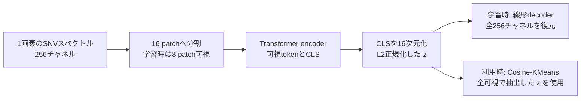

# ChemoMAEの特徴とケモメトリクスにおける位置づけ

調査日: 2026-09-06〜07。対象は、本リポジトリで採用するChemoMAE v0.2.2の構成。
本書は実装確認と文献調査に基づく説明資料であり、研究条件の正は
[実験プロトコル](design/experiment_protocol.md)とする。
文献が示した事実、本構成から導ける性質、今後の評価で確かめる仮説を区別する。

## 1. この構成をどう捉えるか

**PCAと同じく、ラベルなしでスペクトルを圧縮し、得られた座標を可視化・クラスタリングに使う、
という目的に整合した構成である。** 再構成学習をこの用途に使う考え方には、
化学工学のautoassociative networkによる非線形PCAという前例がある。
近年のRaman解析にも、MAEの特徴をPCAなどと比較してクラスタリングする研究と、
非線形encoderを線形decoderと組み合わせる研究がある。
([Kramer, 1991](https://doi.org/10.1002/aic.690370209);
[Ren et al., 2025, §3.2](https://arxiv.org/html/2504.16130v1);
[Georgiev et al., 2024, Methods](https://arxiv.org/html/2403.04526v1))

そのため、説明の中心は「後で分類器をfine-tuneするための事前学習」よりも、
**「マスク再構成を通じて、未知試料にも適用できるスペクトルの低次元座標系を学習する」**
と置くと意図が伝わりやすい。本研究では、学習後のencoderを固定してその座標を直接利用する。

ただし、PCAを数学的に包含する一般化だという意味で「PCAの拡張版」と呼ぶと、説明が過剰になる。
本構成のdecoderは線形1層で、潜在には単位norm制約がある。
**「PCAの役割を担う、線形再構成制約付きの非線形スペクトル表現学習」**
という位置づけが、目的と実装の両方に合っている。

### 1.1 MAEを選んだ理由: augmentationの意味づけへの依存を抑える

2026-09-07にユーザーが明示した採用意図は、**ドメイン固有のaugmentationを中心に学習課題を
設計する負担を抑え、スペクトル自体の帯域間関係から表現を学習したい**というものである。
分光では、どの変換を施しても同じ化学状態として扱ってよいかを決めるのが難しい。
変換が測定上の揺らぎを模すのか、識別したい状態差まで消してしまうのかが問題になる。
これは本研究の動機であり、他のSSLが分光に適用できないという主張ではない。

| 学習方法 | 学習課題におけるviewの役割 | 本研究で問題にしている設計判断 |
| --- | --- | --- |
| [SimCLR](https://proceedings.mlr.press/v119/chen20j.html) | 同一入力から作ったviewを正例として対応づけ、他の例との対比を行う | 何を変えても同じ例として近づけてよいか。原論文もaugmentationの組合せを重要な要素とする |
| [BYOL](https://arxiv.org/html/2006.07733v3) | 一方のviewから、別viewのtarget network表現を予測する | 負例を必要としなくても、対応づけるviewをどう作るかは残る |
| [DINO](https://arxiv.org/html/2104.14294v2) | 異なるview間でteacherとstudentの出力分布を対応づける | 化学的に意味のある情報を保つview・cropの設計が必要になる |
| 本研究のM00 | 可視帯域から隠れた帯域の元の値を予測する | 隠す単位・割合と再構成targetを定める。追加noise・shiftなしで課題が成立する |

BYOL・DINOをSimCLRと同じ負例付き対比学習として扱わない。上表で共通しているのは、
異なるviewの間で何を対応づけるかという設計の必要性であり、損失やaugmentation感度の同一性ではない。
また、これらの対応づけはprojection head等の出力に課されるため、encoderの全情報が厳密に
不変になるという意味でもない。

MAEについての「仮定が少ない」は、**化学状態を保つ変換の族を事前に決めることへの依存を
抑えられる**という限定した意味で用いる。maskも入力を変える操作であり、patch分割、mask率、
SNV、MSE、16次元圧縮、線形decoderといった帰納的な制約はある。
また、予測しやすい帯域間の相関が、目的とする化学状態だけに由来する保証もない。

### 1.2 augmentationは補助、CLSはスペクトル全体の状態表現を担う

本研究の追加noise・shiftは、SNVの画素内平均とnormを保つよう設計し、noise強度を角度で制御する。
ここでの「幾何的整合性」はこの制約との整合を指し、独立に摂動した全画素間の角度保存や、
化学状態の厳密な保存を意味しない。augmentationは、再構成学習を基礎とする表現に、指定した
摂動への安定性を付加できるかを調べる補助的な要素と位置づける。
([augmentationの固定仕様](design/experiment_protocol.md))

目指すのは、潜在の各軸を純粋成分や存在比として同定することではなく、
**スペクトル全体の関係を集約した表現の中で、化学状態に関連する違いがまとまりとして現れるか**
を調べることである。この目的から、再構成に必要な情報を単一のCLS由来bottleneckへ集約する。
CLSは教師あり分類ラベルを表すものではなく、1画素のスペクトル全体を表すための集約tokenである。
ただし、CLSを使うこと自体が化学状態の分離を保証するわけではない。

研究上の問いは、**「可視帯域から隠れた帯域を予測する学習が、全可視で取り出す潜在の幾何を
どう変え、化学状態に関連すると考えられるスペクトル群を、よりまとまりのある表現にするか」**
である。ここでの「構造推論」はスペクトル内の帯域間関係を推定する意味で使い、分子構造や
化学組成を直接同定する意味では使わない。化学状態が連続的に変化し、明確な離散クラスタを
持たない可能性も含めて検討する。

これは再構成の目的からクラスタ構造が生じるかを問う仮説であり、コンパクトで分離したクラスタを
損失が直接要求しているわけではない。現在の外部ラベルを使わない評価では、化学状態との対応は
探索的解釈に留まる。詳細は第5節に示す。

なお、augmentationの**概念上の補助性**と、固定した**実験上の主要比較**は区別する。
M00を追加augmentationなしの基礎条件として説明しつつ、既定のM11対B0・B1・M00という
主要比較、およびnoise・shiftの2×2 ablationを変更するものではない。

## 2. 実装で確認できる構成

### 2.1 スペクトル全体を単一の潜在ベクトルへ圧縮する

| 部分 | 本研究で採用する構成 | 意味 |
| --- | --- | --- |
| 入力 | 画素ごとの256チャネルSNVスペクトル | 1つの入力は1画素のスペクトル。近傍画素や座標はencoderへ渡さない |
| patch | 連続16チャネルを1 patchとする16分割 | patch内は線形射影、patch間の関係はattentionで扱う |
| mask | M00など主比較のMAE条件は16 patch中8個を隠す | 可視8 tokenにCLSを加え、9 tokenをencoderへ入力 |
| encoder | 幅256、8層、8 head、FFN幅1024、GELU、pre-norm、dropout 0 | 学習可能な位置埋め込みを加え、可視patchの情報を非線形に統合 |
| bottleneck | 最終CLSを線形射影して16次元化し、L2正規化 | 学習中も抽出時も、スペクトル全体を単一の単位ベクトルで表す |
| decoder | bias付き `Linear(16, 256)` | 単一の潜在ベクトルから全256チャネルを復元 |
| 損失 | clean SNVに対するMSE | M00は隠したチャネルだけ、A0は全チャネルで平均 |
| 利用時 | 全patch可視、augmentationなし、encoder固定 | 17 tokenから16次元表現を抽出し、Cosine-KMeansへ渡す |

根拠は[固定設定](../src/wood_degradation_map/experiments/config.py)、
[mask生成・表現抽出](../src/wood_degradation_map/experiments/neural.py)、
[学習処理](../src/wood_degradation_map/experiments/training.py)、および
[参照モデルの実装](https://github.com/Mantis-Ryuji/ChemoMAE/blob/4ec7f6acecb82035c85001f5aee508910d40adac/src/chemomae/models/chemo_mae.py)。
今回の説明はプロジェクトが明示する `decoder_num_layers=1` に対するものであり、
ChemoMAEライブラリの別設定まで一律に線形decoderだとするものではない。

decoderへ渡るのは $z$ だけであり、patchごとのencoder出力、入力からのskip connection、
decoder用mask tokenは渡らない。したがって、再構成に使う入力由来の情報は16次元の
bottleneckを通る。これは「小さいdecoder」というだけでなく、**情報を集約する場所を明確にした構成**である。

### 2.2 学習している写像と損失

clean SNVを $x_i\in\mathbb{R}^{256}$、入力側のaugmentationを $g$、
可視patchの集合を $V_i$ とする。$f_\theta$ はCLSの16次元射影までを含むencoderとする。
通常の非ゼロnorm領域では、モデルは次のように書ける。

$$
u_i=f_\theta(g(x_i);V_i),\qquad
z_i=\frac{u_i}{\lVert u_i\rVert_2},\qquad
\hat{x}_i=Wz_i+b,
\quad W\in\mathbb{R}^{256\times16},\quad b\in\mathbb{R}^{256}.
$$

実装のL2正規化は分母にepsilonによる保護を持つ。表現抽出では、正規化前の非有限値、
ゼロnorm、極小normを検査する。上式はその保護が作動しない通常の場合を表す。

M00では $g$ は恒等写像である。隠した8 patchに属するチャネル集合を $M_i$ とすれば、
$|M_i|=8\times16=128$ なので、batch sizeを $B$ とした再構成損失は

$$
\mathcal{L}_{\mathrm{M00}}
=\frac{1}{B}\sum_{i=1}^{B}
\frac{1}{128}\sum_{j\in M_i}
\left([Wz_i+b]_j-x_{ij}\right)^2.
$$

maskを繰り返し抽選し、この損失を小さくすることで、可視帯域から隠れた帯域を予測する写像を学ぶ。
A0は全可視とし、内側の和を全256チャネル、分母を256に変える。
M10・M01・M11では、それぞれnoise・shift・両方を入力側へ適用し、targetはclean SNVのままとする。
適用確率と強度は[実験プロトコル §4.1.3](design/experiment_protocol.md)に従う。
ここでいうnoiseは指定角度の回転による摂動であり、独立な加算Gaussian雑音と同一ではない。

損失にはクラスラベル、KMeansの割当て、空間的一貫性、対比学習の項は含まれない。
上式は再構成の目的関数であり、optimizerのAdamWによるweight decayとは区別する。
実際の学習経路は `Trainer._compute_loss` で、`loss_type="mse"`、`reduction="mean"` と
条件別の `loss_region` を使用する。
([学習処理](../src/wood_degradation_map/experiments/training.py);
[参照Trainer](https://github.com/Mantis-Ryuji/ChemoMAE/blob/4ec7f6acecb82035c85001f5aee508910d40adac/src/chemomae/training/trainer.py);
[参照loss](https://github.com/Mantis-Ryuji/ChemoMAE/blob/4ec7f6acecb82035c85001f5aee508910d40adac/src/chemomae/models/losses.py))

## 3. PCAとの共通点と、数学的に異なる点

### 3.1 「スペクトルの座標と復元方向を学ぶ」という見方

通常の16成分PCAでは、train平均を $\mu$、直交する主成分方向を列に持つ行列を $P$ として、
score $t_i$ と再構成を次のように表す。

$$
t_i=P^{\mathsf T}(x_i-\mu),\qquad
\hat{x}^{\mathrm{PCA}}_i=\mu+Pt_i,\qquad
P^{\mathsf T}P=I_{16}.
$$

ChemoMAEでは、scoreに相当する $z_i$ を非線形encoderが求め、$W$ が共通の復元方向を担う。
行に各スペクトルを並べれば、再構成は

$$
\hat{X}=ZW^{\mathsf T}+\mathbf{1}b^{\mathsf T}
$$

と書ける。**「非線形に推定した座標を用いる、制約付きの低ランク再構成」**という解釈ができる。
これは本構成からの数理的な解釈であり、独立した新手法名や性能上の結論を意味しない。

| 観点 | PCA baseline B1 | 本研究のChemoMAE |
| --- | --- | --- |
| 目的・使い方 | ラベルなしの圧縮後、scoreをクラスタリングへ利用 | ラベルなしの再構成学習後、潜在をクラスタリングへ利用 |
| 入力から座標への写像 | train平均で中心化した線形射影 | 可視patchの関係に依存する非線形写像 |
| 再構成 | PCA部分空間への直交射影 | 単位norm潜在からのアフィン写像 |
| 学習目標 | 全帯域の二乗再構成誤差に対応する分散最大化 | A0は全帯域MSE、MAE条件はmasked MSE |
| 軸の性質 | 固有値による順序と直交性を持つ | 軸の直交性・分散順序を課していない |
| L2正規化 | PCAのfit後、クラスタリング用scoreに適用 | 再構成学習のbottleneck内部から適用 |
| 化学的意味 | loadingの解釈には別途検討が必要 | 潜在成分やdecoder列に化学成分の意味は保証されない |

クラスタリングへ渡す段階ではB1もChemoMAEも16次元の単位ベクトルである。
違いは、PCAでは正規化前のscoreを使って学習・再構成を定義できるのに対し、
本ChemoMAEでは再構成する時点ですでに潜在のnormを取り除いていることにある。

線形autoencoderとPCAの関係は古典的に研究されているが、その同値性は線形写像や二乗誤差などの
条件に依存する。本構成の非線形encoder、mask、単位norm制約へそのまま拡張できない。
([Baldi & Hornik, 1989](https://doi.org/10.1016/0893-6080(89)90014-2))

### 3.2 非線形なのは座標推定であり、復元可能な範囲には強い制約がある

以下は実装の $\hat{x}=Wz+b$ から直接導ける性質である。

$$
\hat{x}\in b+\operatorname{col}(W),\qquad
\operatorname{rank}(W)\le16.
$$

したがって、復元スペクトルは高々16次元のアフィン部分空間に含まれる。
encoderを深くしても、この復元範囲が一般の非線形曲面へ広がるわけではない。
さらに $\lVert z\rVert_2=1$ のため、16次元ベクトルの自由度は通常15である。
$W$ が列full rankなら、単位球面の像はこの部分空間内の楕円体表面になる。
ただし、そのアフィン包の次元まで15になるという意味ではない。

これは、非線形decoderで潜在座標から曲がった復元多様体を作る型の非線形PCAとの違いである。
Kramerのモデルはbottleneckの前後に非線形変換を置くため、現在の線形decoder構成と
同じモデルではない。([Kramer, 1991](https://doi.org/10.1002/aic.690370209))

**全帯域のtrain再構成誤差だけなら、理想的な16成分PCAには優位性がある。**
同じ有限のtrainデータ、同じ前処理、同じ画素重み、二乗誤差を使う場合、
PCAは次元16以下のアフィン部分空間による最小二乗近似を与える。
ChemoMAEの復元もそのような部分空間に含まれるので、厳密演算での最適PCAを基準にすれば

$$
\sum_i\lVert x_i-\hat{x}^{\mathrm{PCA}}_i\rVert_2^2
\le
\sum_i\lVert x_i-(Wz_i+b)\rVert_2^2.
$$

これはPCAの最適性と本decoderの形からの推論であり、実験結果ではない。
比較対象はL2正規化前のPCA scoreで復元したものとし、数値計算・近似solverの差は除く。
masked MSE、未知試料の誤差、クラスタリング品質についての大小関係は、この式からは分からない。

したがって、本構成の価値を検証する焦点は、全trainスペクトルの圧縮誤差でPCAを超えることよりも、
**可視帯域から座標を推定する学習が、未知試料での表現・マップの性質をどう変えるか**にある。
入力摂動の追加が与える効果は、この基礎となる学習に対する補助的な問いとする。

### 3.3 単位normとcosine幾何

単位潜在では、内積がcosine類似度となり、Euclidean距離との間に

$$
\lVert z_i-z_j\rVert_2^2=2\left(1-z_i^{\mathsf T}z_j\right)
$$

が成り立つ。この点で、方向を比較するCosine-KMeansと表現の形式が整っている。
単位球面上のクラスタリングにはspherical KMeansなどの理論的蓄積がある。
([Banerjee et al., 2005](https://jmlr.org/papers/v6/banerjee05a.html))

本入力のSNVも、画素内平均0・標本標準偏差1なので、理想演算では
$\sum_jx_{ij}=0$、$\lVert x_i\rVert_2^2=255$ となる。
スペクトルのoffsetとscaleを取り除いた形状を扱うという意味では整合的である。
([前処理仕様 §5.6](design/preprocessing.md))

ただし、非線形encoderが入力の角度を保存する保証はない。また、復元差は

$$
\lVert\hat{x}_i-\hat{x}_j\rVert_2^2
=(z_i-z_j)^{\mathsf T}W^{\mathsf T}W(z_i-z_j)
$$

で決まり、$W^{\mathsf T}W$ に等方性を課していない。
再構成に重要な方向とcosine上の距離が同じ重みで扱われるとは限らない。
単位normだけで潜在のcollapseを防げるわけでもない。

## 4. 近い先行研究と、どこまで参考になるか

### 4.1 前例の対応表

| 文献 | 本構成とつながる点 | 相違点・引用の範囲 |
| --- | --- | --- |
| [Kramer (1991), 非線形PCA](https://doi.org/10.1002/aic.690370209) | 再構成とbottleneckを使い、化学工学データの次元削減・可視化を行う発想 | maskを使うTransformerではなく、decoder側も非線形 |
| [Hinton & Salakhutdinov (2006)](https://www.cs.toronto.edu/~hinton/absps/science.pdf) | autoencoder自体を次元削減・可視化・検索に使う | 深い非線形decoderを用いる。文中のfine-tuningは再構成を最適化する全体学習も指す |
| [Vincent et al. (2008), Denoising AE](https://www.cs.toronto.edu/~larocheh/publications/icml-2008-denoising-autoencoders.pdf) | 一部を壊した入力から元のデータを復元して表現を学ぶ | 壊し方・構造・評価は異なる。潜在の摂動不変性を直接保証する定理ではない |
| [He et al. (2022), MAE](https://arxiv.org/html/2111.06377v3) | 可視patchだけをencoderへ渡し、masked MSEで学習 | decoderは可視tokenとmask tokenを使うTransformer。全再構成を単一16次元CLSに制限しない |
| [Xie et al. (2022), SimMIM](https://openaccess.thecvf.com/content/CVPR2022/html/Xie_SimMIM_A_Simple_Framework_for_Masked_Image_Modeling_CVPR_2022_paper.html) | masked modelingで単純な線形予測headを使う | 各位置のencoder特徴から復元する構成で、単一の低次元潜在ではない。原論文の損失はL1 |
| [Georgiev et al. (2024), Raman unmixing AE](https://arxiv.org/html/2403.04526v1) | 非線形encoderと線形decoderの組合せ。Transformer encoderの例もある | 物理制約を用いた成分分離が目的で、MAEではない |
| [Ren et al. (2025), Raman SMAE](https://arxiv.org/html/2504.16130v1) | スペクトルのmask再構成と、得た表現によるPCA等とのクラスタリング比較 | Transformer decoderを用い、教師ありfine-tuningも別途評価する |

### 4.2 構成として特に近い例: Raman unmixing AE

Georgievらは、Ramanスペクトルの非線形encoderに、biasなしの線形decoderを組み合わせる。
encoderの候補にはDense、Convolutional、Transformerなどを含む。
したがって「encoderは複雑でも復元は線形に制約する」という設計には、分光解析で具体的な前例がある。
([Georgiev et al., Methods: Autoencoder architectures / Decoder choice](https://arxiv.org/html/2403.04526v1))

同研究はdecoder重みの非負性と、潜在の非負性・必要に応じた総和1の制約を使い、
重みをendmember、潜在を存在比として扱う。一方、本ChemoMAEにはその物理制約がなく、
SNV入力、bias、符号を許す単位潜在を使う。**この前例は構成の合理性を説明する根拠になっても、
本モデルの潜在を化学成分濃度と呼ぶ根拠にはならない。**

調査した前例のうち、**スペクトルからglobalな潜在を求め、非線形encoderと線形decoderで
再構成するという構成上の比較対象としては、Georgievらが特に近い**。
一方、本研究は化学成分への分解を課す代わりに、mask再構成から状態に関連するまとまりが
生じるかを問う。この目的の違いを含めて引用する。MAEという学習課題と、得た特徴による
クラスタリングの前例としては、次節のRenらを併せて位置づける。

### 4.3 使い方として特に近い例: Raman SMAE

RenらのSMAEは、スペクトルpatchを隠して再構成するTransformer型モデルである。
§3.2ではラベルを学習に使わず、得られた表現をKMeansへ渡し、PCAなどと比較している。
「スペクトルMAEを教師なしの特徴抽出器として利用する」という目的に近い。
([Ren et al., §2.2 / §3.2](https://arxiv.org/html/2504.16130v1))

ただし、同節のPCA等との比較はreference subsetを対象とし、別節の教師ありfine-tuning評価と
区別される。本研究の試料単位OOF評価と同一条件ではない。
また、decoderへtoken列を渡すため、現在の単一16次元潜在とは圧縮の制約が異なる。
論文中の優劣や精度を、そのまま古材NIRでの性能予測に用いることはできない。

### 4.4 「弱いdecoderなら固定特徴に有利」とまでは言えない

本構成ではdecoderが非線形な処理を担えないため、encoder側に「線形に復元できる座標」を
作る役割がある。これは構造の説明として妥当である。しかし、その座標が分類・クラスタリングに
有用かどうかは別の問いである。

原MAEのdecoder深さの比較では、encoderを固定するlinear probingに十分なdecoder深さが
重要だったと報告されている。著者らは、decoderに再構成への特化を担わせることで、
潜在をより抽象的に保てると解釈している。([He et al., §4.1 Decoder design](https://arxiv.org/html/2111.06377v3))

これは画像認識での結果であり、本ChemoMAEを否定するものでも、decoderを深くすべきという
結論でもない。**decoderの単純さは本研究の採用制約であって、固定表現の品質を保証する法則ではない。**
同様に、SimMIMの線形headの成功も、globalな16次元bottleneckの最適性までは検証していない。

## 5. 本研究で主張できる特徴と、評価を待つ事項

| 項目 | 現時点での位置づけ |
| --- | --- |
| fine-tuningを要しない利用 | 現行pipelineの事実。学習後のencoderを固定し、trainでfitしたKMeans中心をtestへ適用する |
| globalな低次元圧縮 | 構成の事実。復元はCLS由来の単一16次元潜在を通る |
| augmentationへの依存を抑える | MAEの採用意図。M00は追加noise・shiftなしで成立するが、手法全体が仮定不要という意味ではない |
| 帯域間の関係を使った座標推定 | mask再構成の課題設定。どの関係を実際に学んだかは別途解釈が必要 |
| 化学状態に関連する自然なまとまり | 検証したい仮説。再構成lossもCLSへの集約も、クラスタの生成・分離を保証しない |
| noise・shiftへの頑健性 | 入力側摂動からcleanを復元させる設計意図。潜在やlabelの不変性は未保証で、LFRで評価する |
| PCAより良い領域分割 | 実験で検証する問い。構造や参考論文だけでは結論できない |
| 化学成分・劣化度の抽出 | 外部の独立した裏づけはない。現在はスペクトル・マップに基づく探索的解釈 |
| 各構成要素の最適性 | 8層、16次元、線形decoder、L2正規化それぞれの最適性を比較する実験ではない |
| 新規性 | 既存要素の組合せと古材NIRでの評価を具体的に説明する。「初の構成」とは主張しない |

とくに、以下を解釈に含める。

- **mask学習と全可視利用の差:** M00は学習時に可視8 patch、利用時に可視16 patchとなる。
  全可視時の表現が有用かは、現在の抽出・評価条件で確かめる。`eval()`だけでmaskが無効になる
  実装ではなく、全可視maskを明示する。
- **復元方向の解釈:** $W$ の列は復元方向だが、直交性・分散順序・純粋成分の制約はない。
  直交行列 $Q$ に対して $z'=Qz$、$W'=WQ^{\mathsf T}$ としても復元とcosine距離は変わらず、
  潜在の各軸は一意には定まらない。
- **欠測への外挿:** 現在のmaskは全帯域でSNVを計算した後に適用する。
  したがって、未測定帯域があってSNV自体を同じように計算できない測定条件への対応を
  実証したことにはならない。
- **比較から分かる範囲:** M00対A0はmaskの有無と損失領域の変更を含む比較である。
  B1対ChemoMAEには非線形性だけでなく、正規化を学習内部で使うかどうかなどの差もある。
  各差を単独の因果効果として説明しない。

現行の試料単位5-fold・3反復では、未知試料のマップについてLLAとLFRを主に比較する。
encoderに空間情報を入力しないことと、得られたlabelの空間的一貫性を測ることは両立する。
ただし、高い一貫性や安定性だけで化学的正しさは示せないため、occupancyや反復間ARIなども
併せて確認する。cosine-silhouetteは各表現空間の診断であり、異なる表現間の化学的妥当性の
共通尺度とはしない。([評価指標](design/evaluation_metrics.md))

## 6. クラスタリング方法への依存性

ChemoMAEの表現をCosine-KMeansで評価する主実験に加え、同じ学習済み表現にvMF mixtureを
適用する補助実験を計画している。目的は、表現に関する結論がクラスタリング方法を変えても
保たれるかを調べることである。実施範囲・利用版・採用前の検証事項は
[実験プロトコル第5.2節](design/experiment_protocol.md#vmf-supplementary)で管理する。

## 7. 説明文として使える表現

以下は研究の位置づけを説明する文案であり、未完了の比較結果を述べるものではない。

### 短い説明

> ChemoMAEを、ケモメトリクスにおけるPCAのような教師なし次元削減器として用いる。
> 化学状態を保つaugmentationの設計への依存を抑えるため、帯域間の予測関係を学ぶマスク再構成を
> 基礎とする。スペクトル全体をCLS由来の単一潜在へ集約し、その表現に化学状態に関連する
> まとまりが現れるかを検証する。追加augmentationは、指定した摂動への安定性を補う要素とする。

### 論文・発表向けの説明

> 本研究では、マスク自己教師あり学習を用いて、近赤外スペクトルの低次元表現を学習する。
> その役割は、ケモメトリクスでPCAが担うスペクトル圧縮と教師なし構造探索に対応する。
> 化学状態を保つview変換を事前に定める負担を抑えるため、可視帯域から隠れた帯域を予測する
> 再構成課題を学習の基礎に置く。追加noise・shiftは、SNVの幾何的制約に整合する範囲で
> 摂動への安定性を補う要素として検討する。
> Transformer encoderは可視スペクトルpatchを単一の16次元単位ベクトルへ集約し、
> アフィンdecoderが全スペクトルを復元する。これにより、可視帯域からの非線形な座標推定と、
> 共通の復元方向による低ランク表現を組み合わせる。潜在軸を化学成分へ対応づける制約は課さず、
> この学習が化学状態に関連するスペクトル群のまとまりへどう影響するかを問う。
> 学習後は全帯域を可視としてencoderを固定し、
> 得られた表現をcosineクラスタリングへ用いる。評価では、PCAなどのbaselineに対する未知試料の
> 領域分割の空間的一貫性と、指定したスペクトル摂動へのlabel安定性を比較する。

この位置づけの背景としては、非線形PCA、Raman unmixing AE、Raman SMAEをそれぞれ
「利用目的」「非線形encoderと線形decoder」「mask学習とクラスタリング」の文脈で引用できる。
([Kramer, 1991](https://doi.org/10.1002/aic.690370209);
[Georgiev et al., 2024](https://doi.org/10.1073/pnas.2407439121);
[Ren et al., 2025](https://arxiv.org/html/2504.16130v1))

### 英語での短い定義

> We use ChemoMAE as an unsupervised spectral representation model for chemometric analysis.
> Masked reconstruction is the core learning task, reducing reliance on domain-specific
> augmentations whose preservation of chemical state is difficult to establish.
> A nonlinear Transformer encoder maps visible spectral patches to a single unit-norm latent
> vector derived from CLS, and an affine decoder reconstructs the spectrum from this bottleneck.
> We investigate whether learning inter-band predictive relationships produces latent groupings
> associated with differences in chemical state, without imposing an explicit unmixing model.
> Additional augmentations serve a supporting role in studying stability to specified perturbations.
> After masked reconstruction training, the encoder is frozen and applied to fully visible
> spectra for cosine-based clustering. This provides a PCA-inspired approach to spectral
> compression and structure exploration, with nonlinear coordinate inference and an explicit
> linear reconstruction constraint.

## 8. 参考文献と確認範囲

論文本文または著者公開原稿を優先して確認した。以下の関連研究が本ChemoMAEと完全に同じ
構成・前処理・評価条件を検証した、という意味ではない。網羅的な新規性調査でもない。

1. Baldi, P. & Hornik, K. (1989).
   [Neural networks and principal component analysis: Learning from examples without local minima](https://doi.org/10.1016/0893-6080(89)90014-2).
   *Neural Networks*, 2(1), 53–58。
   [著者公開PDF](https://www.igb.uci.edu/~pfbaldi/publications/journals/1989/NN_and_PCA.pdf)。
2. Kramer, M. A. (1991).
   [Nonlinear principal component analysis using autoassociative neural networks](https://doi.org/10.1002/aic.690370209).
   *AIChE Journal*, 37(2), 233–243。
   [大学公開PDF](https://people.engr.tamu.edu/rgutier/web_courses/cpsc636_s10/kramer1991nonlinearPCA.pdf)。
3. Hinton, G. E. & Salakhutdinov, R. R. (2006).
   [Reducing the Dimensionality of Data with Neural Networks](https://doi.org/10.1126/science.1127647).
   *Science*, 313, 504–507。
   [著者公開PDF](https://www.cs.toronto.edu/~hinton/absps/science.pdf)。
4. Vincent, P., Larochelle, H., Bengio, Y. & Manzagol, P.-A. (2008).
   [Extracting and Composing Robust Features with Denoising Autoencoders](https://doi.org/10.1145/1390156.1390294).
   *ICML*。
   [著者公開PDF](https://www.cs.toronto.edu/~larocheh/publications/icml-2008-denoising-autoencoders.pdf)。
5. He, K. et al. (2022).
   [Masked Autoencoders Are Scalable Vision Learners](https://arxiv.org/abs/2111.06377).
   *CVPR*。構成とdecoder比較は[公開本文 §3–4](https://arxiv.org/html/2111.06377v3)を参照。
6. Xie, Z. et al. (2022).
   [SimMIM: A Simple Framework for Masked Image Modeling](https://openaccess.thecvf.com/content/CVPR2022/html/Xie_SimMIM_A_Simple_Framework_for_Masked_Image_Modeling_CVPR_2022_paper.html).
   *CVPR*, 9653–9663。
7. Georgiev, D. et al. (2024).
   [Hyperspectral unmixing for Raman spectroscopy via physics-constrained autoencoders](https://doi.org/10.1073/pnas.2407439121).
   *PNAS*。構成の詳細は[著者公開原稿のMethods](https://arxiv.org/html/2403.04526v1)を確認。
8. Ren, P., Zhou, R.-G. & Li, Y. (2025).
   [A Self-supervised Learning Method for Raman Spectroscopy based on Masked Autoencoders](https://arxiv.org/abs/2504.16130).
   本書の構成・実験の説明は[公開原稿v1](https://arxiv.org/html/2504.16130v1)に基づく。
   [刊行版](https://doi.org/10.1016/j.eswa.2025.128576)の全文との差分は未照合。
9. Banerjee, A., Dhillon, I. S., Ghosh, J. & Sra, S. (2005).
   [Clustering on the Unit Hypersphere using von Mises-Fisher Distributions](https://jmlr.org/papers/v6/banerjee05a.html).
   *JMLR*, 6, 1345–1382。
10. Chen, T., Kornblith, S., Norouzi, M. & Hinton, G. (2020).
    [A Simple Framework for Contrastive Learning of Visual Representations](https://proceedings.mlr.press/v119/chen20j.html).
    *ICML*, PMLR 119, 1597–1607。SimCLRのaugmentationの役割を参照。
11. Grill, J.-B. et al. (2020).
    [Bootstrap Your Own Latent: A New Approach to Self-Supervised Learning](https://arxiv.org/abs/2006.07733).
    *NeurIPS*。異なるview間の予測を行うBYOLの課題定義を参照。
12. Caron, M. et al. (2021).
    [Emerging Properties in Self-Supervised Vision Transformers](https://arxiv.org/abs/2104.14294).
    *ICCV*。[公開本文 §3.1](https://arxiv.org/html/2104.14294v2)のDINOのview間対応を参照。

実装確認は固定config、利用側コード、導入済みChemoMAEのソースを読み取って行った。
文献調査のための学習・評価・ベンチマークは実行していない。
