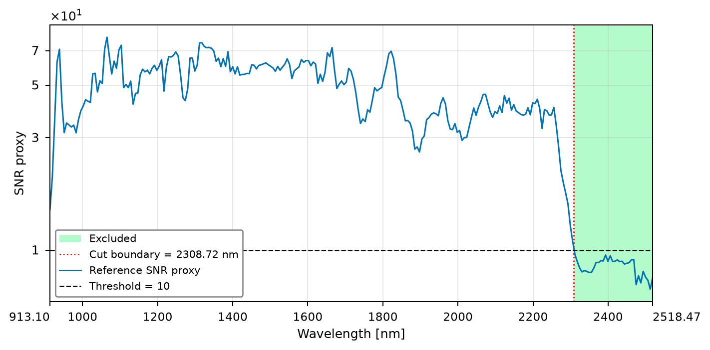

# 付録A 前処理の定義と確認資料

本付録は、[第3.2節](../chapters/3_analysis_methods/preprocessing.md)の前処理を、処理の定義と確認資料に分けて補足する。A.1〜A.4でマスク、波長範囲、補間、有効画素の規約を定義し、A.5で既存の診断図の集計対象と読み取り方を説明する。定義した条件を適用することと、出力の性質を確認することを区別する。以下は現行の本番前処理に対応し、新しい前処理条件を追加するものではない。

## A.1 生強度に基づくマスク

元画像の行・列を $(u,v)$、元の測定bandの添字を $b=0,\ldots,C_{\mathrm{src}}-1$、そのband数を $C_{\mathrm{src}}=256$ とする。$S_{\mathrm{raw}}(u,v,b)$ は画素 $(u,v)$ におけるband $b$ の生強度である。$S$ は測定信号（signal）、添字rawは反射率変換前の値であることを表す。マスク用の明るさの指標 $A(u,v)$ を

$$
A(u,v)=\sum_{b=0}^{C_{\mathrm{src}}-1}S_{\mathrm{raw}}(u,v,b)\tag{A.1}
$$

と定義し、試料ごとに3-class Multi-Otsuで強度順のclass 0、1、2へ分ける。Class 1と2に属する画素の集合を候補マスク $M_{\mathrm{cand}}$、半径1画素の円盤状構造要素を $\mathcal{B}_{\mathrm{ero}}$ とすると、形態処理は

$$
M_{\mathrm{morph}}=\mathrm{RemoveSmall}\left(M_{\mathrm{cand}}\ominus \mathcal{B}_{\mathrm{ero}};\,\text{min size}=1,\,\text{connectivity}=8\right)\tag{A.2}
$$

で表せる。$M_{\mathrm{morph}}$ は形態処理後の画素集合、$\ominus$ は二値erosion、$\mathrm{RemoveSmall}$ は指定サイズ未満の連結領域を除く操作を表す。実装上のconnectivity引数2は、二次元の8近傍に対応する。最小サイズ1画素の設定では、追加の小領域除去は実質的に行われない。穴埋め、closing、最大連結成分だけの選択は加えない。

このマスクは生強度に基づく形態的な候補範囲であり、反射率・SNV・RGB画像を用いるものではない。後述のスペクトル品質条件で除外された画素を区別できるよう、形態マスクと最終有効画素マスクを別に保持する。

## A.2 Reference由来SNR proxyと終端cutoff

$W(v,b)$ と $D(v,b)$ は、検出器列 $v$・測定band $b$ に対応するwhiteおよびdark referenceの値である。その差を $Q(v,b)=W(v,b)-D(v,b)$、列数を $N_v=320$ とする。$\overline{Q}_b$ を列方向の平均、$s^{(0)}_{Q,b}$ を列方向の母標準偏差、$\gamma_b$ をreference由来SNR proxyとして、

$$
\begin{aligned}
\overline{Q}_b
&=\frac{1}{N_v}\sum_{v=0}^{N_v-1}Q(v,b),\\
s^{(0)}_{Q,b}
&=\sqrt{\frac{1}{N_v}\sum_{v=0}^{N_v-1}
\left(Q(v,b)-\overline{Q}_b\right)^2},\\
\gamma_b
&=\frac{\overline{Q}_b}{s^{(0)}_{Q,b}+10^{-12}}.
\end{aligned}
\tag{A.3}
$$

と定義する。上付き $(0)$ は標準偏差の自由度補正が0であることを表し、分母に列数 $N_v$ を用いる。画素内SNVに用いる、帯域数から1を引いた分母の標本標準偏差とは区別する。$10^{-12}$ は除算保護の微小値である。$\gamma_b$ は無次元であり、whiteとdarkの差が検出器列間でどの程度そろっているかを表す。反復撮像による時間方向のSNRや、個々の試料画素のSNRを直接推定する量ではない。

$\gamma_b\leq10$ または非有限となるbandを低proxyのbandとする。最終bandまで連続する低proxyの区間を除外し、それより前を保持する。終端より前にも離れた低proxy区間がある場合には、単一の上限cutoffでは指定した規約を表せないため処理を停止する。保持できるbandが2点未満になる場合も処理を停止する。すべてのbandが有効なら終端除外は行わない。

現行の記録では、band 0–221の222点を保持し、band 222–255の34点を除外している。最後の保持波長は2305.59 nm、最初の除外波長は2311.85 nmであり、図示する境界は両者の中点2308.72 nmとする。この境界値自体を測定bandとして補間へ追加することはない。これらの判定量と試料側の分布を並べた既存図は[A.5.1](#cutoff-diagnostics)に示す。

## A.3 線形補間

保持band数を $C_{\mathrm{keep}}=222$、保持波長を $\lambda_0<\cdots<\lambda_{C_{\mathrm{keep}}-1}$ とする。補間先の波長 $\widetilde{\lambda}_j$ は、この範囲の両端を含む等間隔gridの第 $j$ 点であり、出力チャネル数 $C=256$ に対し $j=0,\ldots,C-1$ とする。画素の添字を $p$、測定反射率を $R_{p,b}$、補間反射率を $\widetilde{R}_{p,j}$、右側の測定値に掛ける補間重みを $\omega_j$ とする。$\lambda_b\leq\widetilde{\lambda}_j\leq\lambda_{b+1}$ を満たす隣接bandを選び、

$$
\omega_j=\frac{\widetilde{\lambda}_j-\lambda_b}{\lambda_{b+1}-\lambda_b},
\qquad
\widetilde{R}_{p,j}=(1-\omega_j)R_{p,b}+\omega_j R_{p,b+1}\tag{A.4}
$$

とする。補間先は保持範囲の閉区間内なので、$0\leq\omega_j\leq1$ である。端点では対応する実測値を保持する。現行入力は222点から256点へ補間するが、この操作によって独立な測定情報が増えるわけではない。

本文のFractional Shiftも線形補間を用いるが、目的と定義域が異なる。前処理の補間は保持した測定範囲内の共通gridを作る処理であり、外挿しない。Shiftではその共通grid上の参照位置を移動させ、範囲外に端点値を延長する。

## A.4 有効画素と除外理由

形態マスク内の画素へ、次の順で品質条件を適用する。

| 順位・理由code | 除外する条件 | 補足 |
| --- | --- | --- |
| 1 | 保持bandの反射率に非有限値がある | 反射率の分母が非正・非有限の場合も反射率の非有限値として扱う |
| 2 | 補間後の標本標準偏差が非有限または0以下 | SNVを定義できない |
| 3 | 上記を通過した補間反射率に負のbandがある | 1 bandでも負なら画素全体を除外 |

理由が重なる場合は上表の順序を優先する。負値は0に置換せず、画素単位の除外とする。反射率の一つのbandが0であることや1を超えることだけでは除外せず、品質統計に記録する。

保存する有効画素集合は全条件で共通とする。除外画素の元座標と理由、形態マスクと有効画素マスクの対応を保持する。後段の表現抽出で問題が起きた画素を、前処理の有効集合から条件別に除いてよいという規約ではない。

## A.5 前処理の確認資料

ここでは、波長選択を確認する既存図と、試料表面の反射率の大きさを確認するmapを扱う。図の統計量はそれぞれの目的に応じて対象画素と波長点が異なるため、最終的な学習入力や画素除外率との対応を明示する。

### A.5.1 波長範囲の確認図

**図A.1 終端波長範囲の選択と試料スペクトルの確認。** 横軸は共通して元の測定波長（nm）であり、保持範囲を淡緑色、除外範囲を淡橙色、両者の境界2308.72 nmを橙色の縦点線で示す。上から、(1) reference由来SNR proxy $\gamma_b$ と固定閾値10、(2) 反射率の試料別99%点の中央値と1%点の中央値の差、(3) 非有限値・負値・1を超える反射率について求めた試料別割合の最大値、(4) 元の全256 bandsで計算した診断用SNVに対する、(2)と同じ集計による幅を示す。第1段のみ縦軸は対数尺度である。第2〜4段は波長除外・補間前の形態マスク内の値から作成した確認量であり、cutoffを決める判定量は第1段である。

#### A.5.1.1 各パネルの値と集計対象

図の横軸は、最終入力の256点の補間gridではなく、除外範囲も含む元の256測定bandsである。各折れ線の点はその測定bandでの値に対応し、点間の線は変化を見やすくするために結んでいる。淡緑色の表示範囲は保持するband群、淡橙色は除外するband群を示し、個々の画素の合否を表すものではない。

**第1段：Reference SNR proxy。** 黒線は式(A.3)の $\gamma_b$、青破線は閾値10を表す。縦軸は対数尺度なので、縦方向の同じ距離は値の同じ差ではなく同じ比を表す。描画では正かつ有限のproxyだけを線として表示する。一方、除外規約では非有限のproxyも低proxyとして扱うため、表示されない値を保持可能な値と読み替えない。

**第2段：Reflectance 1–99% span。** まず試料ごと・測定bandごとに、形態マスク内の反射率から有限値だけを取り出し、画素間分布の1パーセンタイル値（1%点）と99パーセンタイル値（99%点）を求める。次に、同じbandの1%点について試料間の中央値を取り、99%点についても別に試料間の中央値を取る。青線は「99%点の中央値 − 1%点の中央値」であり、単位は反射率と同じ無次元である。

この順序では、画素数の多い試料ほど集計への重みが増えることはない。全試料の画素をまとめた分布の1–99%幅でも、各試料で先に求めた幅の中央値でもない。各試料の百分位点は有限画素値を昇順に並べ、百分位の位置が整数でない場合に隣接する順序統計量を線形補間して求める。幅は主に画素間の分布の広がりを表し、平均反射率や平均値の信頼区間を示すものではない。

**第3段：Maximum sample fraction。** 各試料・各bandで次の三つの割合を求め、その後、同じbandについて試料間の最大値をそれぞれ表示する。

| 凡例・色 | 試料内で数える画素 | 割合の分母 |
| --- | --- | --- |
| Non-finite・桃色 | 反射率がNaNまたは無限大の画素 | 形態マスク内の全画素数 |
| Reflectance < 0・橙色 | 有限な反射率が厳密に0未満の画素 | そのbandの反射率が有限な画素数 |
| Reflectance > 1・青色 | 有限な反射率が厳密に1を超える画素 | そのbandの反射率が有限な画素数 |

縦軸は0〜1の割合であり、例えば0.1は、少なくとも一つの試料で該当割合が10%になったことを表す。全試料の画素をまとめた割合でも、試料割合の平均でもない。最大値を与える試料はbandや項目ごとに異なり得る。また、三曲線は分母が共通でなく最大を取る試料も一致するとは限らないため、三つを足して一つの除外率にしない。図の割合はband単位の確認量であり、複数bandの条件をまとめて判定する最終の画素除外率とも区別する。

**第4段：SNV 1–99% span。** 波長を除外する前の全256測定bandsの反射率に、画素ごとにSNVを適用する。その後、各bandの有限なSNV値について第2段と同じ百分位点・試料間中央値・差の順で集計する。この診断用SNVでは、全256 bandsが有限で、画素内の標本標準偏差が正かつ有限の画素だけをSNVへ変換する。変換できない画素の全bandはNaNとなり、百分位点の計算から外れる。負の反射率を含んでも、この診断段階では上記のSNV条件を満たせば集計対象になる。

したがって、第2段の百分位点の対象はbandごとに有限な反射率を持つ画素であり、第4段の対象は全元bandsでSNVを定義できる画素である。両者の対象画素が必ず一致するわけではない。有限値が一つもない試料・bandの百分位点と、分母が0となる負値・1超の割合は欠測として試料間の中央値・最大値の集計から外す。全試料で欠測ならそのbandの集計値も欠測となる。

第4段のSNVは診断専用である。第3.2節で学習入力 $\boldsymbol{x}_p$ としたSNVは、波長の除外、保持222点から共通256点への補間、品質条件による画素除外を経て計算する。ここで $p$ は有効画素の添字であり、$\boldsymbol{x}_p$ はその画素の最終SNVスペクトルを表す。診断用SNVと最終SNVは、平均・標準偏差を計算する波長点と対象画素が異なるため、図の第4段を学習入力の分布そのものとして説明しない。

#### A.5.1.2 この図から読み取る内容

第1段では長波長端でproxyが低下し、閾値10以下となる連続区間が終端まで続く。この規約から除外される34 bandsの中では、第2段の反射率の幅と第4段の診断用SNVの幅が長波長側へ広がり、第3段では負の反射率の最大試料割合が増加している。非有限値と1を超える値の曲線は、この図では負値の曲線に比べて低い。これらは既存図からの定性的な読み取りであり、曲線から厳密な最大値を推定して報告するものではない。

反射率の式(3.1)ではwhiteとdarkの差が分母に入る。その値や列間のばらつきは反射率の安定性に関わるため、referenceのproxyと試料側の分布・値域を同じ波長軸上で確認する意義がある。ただし、試料内の分布の幅には材料・表面の違いも含まれ、この図だけで広がりの全量を測定ノイズと断定することはできない。また、SNV後も長波長端の分布幅が広いことは、SNVが画素内の平均・scaleをそろえる操作であり、不安定な個別bandを自動的に除く処理ではないことと整合する。

波長範囲を決めるのは、固定閾値と終端連続区間の規約である。第2〜4段を見て閾値を調整したり、最終マップやCV評価が良くなる境界を探索したりしたものではない。境界2308.72 nmは保持・除外bandの間を示す描画上の位置であり、補間の上限は最後の保持測定波長2305.59 nmである。

### A.5.2 確認用の反射率norm map

空間的な確認用の量として、有効画素の座標 $(u,v)$ におけるSNV前の補間反射率 $\widetilde{R}(u,v,j)$ から、その全 $C=256$ チャネルのL2 normを表す $\operatorname{Norm}_R(u,v)$ を

$$
\operatorname{Norm}_R(u,v)=\sqrt{\sum_{j=0}^{C-1}\widetilde{R}(u,v,j)^2}\tag{A.5}
$$

として求める。ここで $j$ は補間後のチャネル添字である。背景と品質条件による除外画素にはこの値を割り当てず、表示時は透明とする。この量は反射率スペクトルの大きさをまとめたものであり、化学成分量や劣化度の正解ではない。SNV後のnormは全有効画素でほぼ $\sqrt{255}$ となるため、この確認mapには用いない。

---

## A.6 出典と執筆メモ（本文外）

- 定義：[前処理仕様](../../docs/design/preprocessing.md)。
- 実装：[production前処理](../../src/wood_degradation_map/preprocessing/production_preprocessing.py)、[波長grid](../../src/wood_degradation_map/preprocessing/spectral_grid.py)。
- 波長cutoffの既存記録：[cutoff_decision.json](../../data/processed/production_v1/cutoff_decision.json)。本ドラフト作成時に読み取りで確認した。
- 図A.1の集計・描画：[band統計と試料間集計](../../src/wood_degradation_map/preprocessing/spectral_quality.py)、[描画処理](../../src/wood_degradation_map/preprocessing/visualization.py)。描画入力は元bandのsource_band_summaryであり、補間後のoutput_band_summaryとは区別する。
- 図A.1の既存出力：[cutoff_decision.png](../../outputs/preprocessing/production_v1/cutoff_decision.png)。
**残る整備。** 試料別の有効・除外画素数、マスク前後の表示例、SNVの数値誤差、TGN・shiftの強度確認図を追加候補とする。元資料を照合してから掲載し、このドラフトで未確認の数値を埋めない。
