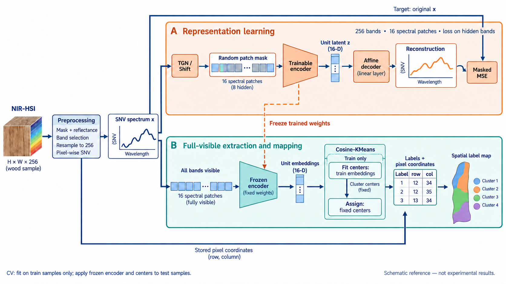

# 3.1 解析の全体像と入出力

## 3.1.1 解析対象と出力

本研究では、古材の近赤外ハイパースペクトル画像（near-infrared hyperspectral imaging; NIR-HSI）から画素ごとのスペクトル表現を学習し、その表現に基づいて試料表面の領域をマッピングする。解析は、観測データの前処理、自己教師あり表現学習、学習済みencoderによる表現抽出、クラスタリング、および元画像上へのラベルの配置から構成される。画素単位の化学状態や劣化状態の正解ラベルを学習に用いず、スペクトル間の関係から領域分布を記述することを目的とする。

前処理では、生強度画像から試料領域を抽出し、white/dark referenceによる反射率変換、保持波長範囲の選択、共通波長gridへの補間、およびstandard normal variate（SNV）変換を行う。各有効画素の入力を、256チャネルのSNVスペクトル $\boldsymbol{x}\in\mathbb{R}^{256}$ とする。スペクトルと元画像の画素座標との対応は保持するが、座標および近傍画素の情報をencoderの入力には含めない。したがって、本手法は画素スペクトルを入力とする表現学習であり、画像の空間patchから領域を直接予測するモデルではない。

## 3.1.2 表現学習とマップ作成

表現学習には、スペクトルの一部の帯域を隠し、可視帯域から隠れた帯域を復元するmasked reconstructionを用いる。提案条件では、さらにSNV後の平均ゼロ・一定normという制約を保つTangent Gaussian Noise（TGN）およびFractional Shiftを入力側に適用する。復元targetには追加摂動前の観測スペクトルを用い、帯域の補完と追加摂動からの復元を組み合わせたmasked denoisingを学習課題とする。以後、追加摂動前の観測をcleanと呼ぶ。この呼称は人工的な追加摂動との区別を表し、測定ノイズのない真値を意味しない。

Encoderは可視帯域の情報を統合し、スペクトル全体を単一の16次元単位ベクトルである潜在表現 $\boldsymbol{z}$ へ圧縮する。学習時には、この潜在ベクトルからbias付き線形decoderで全256チャネルを復元し、各条件で定めた帯域の再構成誤差を最小化する。再構成損失には、クラスタラベルや空間的一貫性に関する項を含めない。

マップ作成時には、追加摂動とランダムマスクを適用せず、全帯域を可視とした入力から固定encoderで潜在表現を抽出する。その後、cosine類似度に基づくクラスタリングによって各画素へラベルを割り当て、保存した画素座標を用いて試料表面のラベルマップを作成する。Decoderは表現学習のために用い、通常のマップ作成には用いない。

**図3.1（仮） 解析全体の流れ。** 上段は主比較のMAE条件における表現学習、下段は学習済みencoderを固定した表現抽出とマップ作成を示す。提案条件ではTGN・shiftを適用した入力から追加摂動前の観測を復元し、利用時は全帯域可視の入力から得た単位潜在をクラスタリングする。画素座標はラベルの配置にのみ用いる。図中のスペクトル、画素座標およびマップは模式的な例であり、実測値・解析結果を表さない。

図中のxは追加摂動前のSNVスペクトル $\boldsymbol{x}$、zは学習時の単位潜在 $\boldsymbol{z}$ を表す。下段のUnit embeddingsは全帯域可視で抽出する単位潜在であり、第3.4節では $\boldsymbol{z}^{\mathrm{full}}_p$ と書く。ここで $p$ は画素添字、fullは全patch可視を意味する。入力形状のHとWは、それぞれ画像の行数と列数を表す参考図のラベルである。

## 3.1.3 比較と解釈への接続

本研究では、この処理を試料単位のcross-validation（CV）による比較と、全試料を用いる記述的な解析の二つの場面で用いる。CVではencoderとクラスタ中心をtrain試料から求め、test試料には固定した変換・中心を適用する。これにより、学習・中心推定に用いなかった試料への適用時のマップの性質を比較する。全体fitでは、全試料に共通するモデルによって領域分布とスペクトル差を記述し、化学的な対応を探索的に検討する。両者はfit対象と証拠の役割が異なるため、第4章で分けて定義する。

クラスタはスペクトル表現上の分割であり、あらかじめ定義された劣化段階や化学成分を直接表すものではない。本章ではマップを得るまでの方法を定義し、比較条件、評価指標および化学的解釈の設計は第4章で述べる。

---

## 執筆メモ（本文外）

- **参照資料：** [研究概要](../../../docs/research_overview.md)、[実験プロトコル](../../../docs/design/experiment_protocol.md)。第4章はLLA・補正LLAのみ執筆済みで、比較条件等の本文は未執筆。
- **図の整備：** 図3.1は最終稿で著者による作図に差し替える。生成promptとラベル・経路の修正事項は[図の記録](../../figures/analysis_workflow_notes.md)に集約する。
